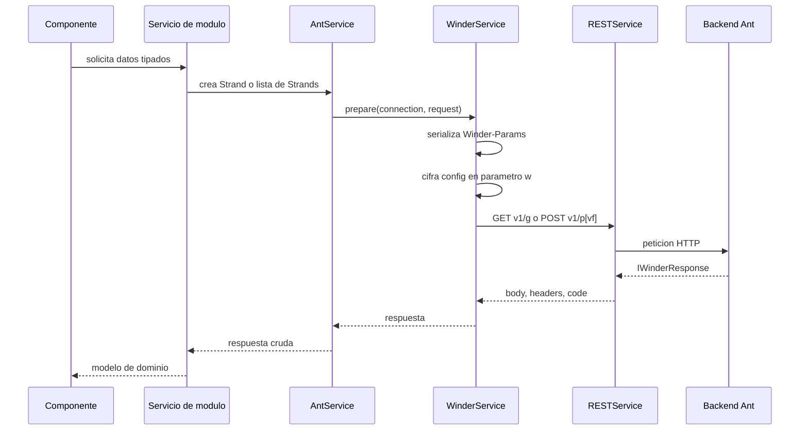

# Flujo de datos y responsabilidades

## Arranque

`main.ts` inicia `App` con `appConfig`. Los inicializadores restauran la sesion, aplican preferencias y arrancan el registro de reportes recientes antes de que el shell quede operativo.

## Peticion Winder

## Responsabilidades

- `AntService`: helpers genericos para GET, POST, recursos y archivos.
- Servicios `Mod*`: fijan `port`, `appId`, strands y nombres de respuesta del backend.
- Servicios de modulo: traducen respuestas crudas a modelos de pantalla.
- `shared/ui`: presenta datos; no debe decidir autorizacion.
- `ShellStateService`: expone identidad, rol, subsistemas, menu activo y estados del shell.

## Dos fronteras de datos

1. Winder/Ant: contrato legado con `Strand`, `Winder-Params`, `w` y respuesta `IWinderResponse`.
2. Host/API: peticiones no Winder reciben `Authorization` y `X-User-Role`, excepto login y Google.

La documentacion de cada servicio debe declarar a cual frontera pertenece.
