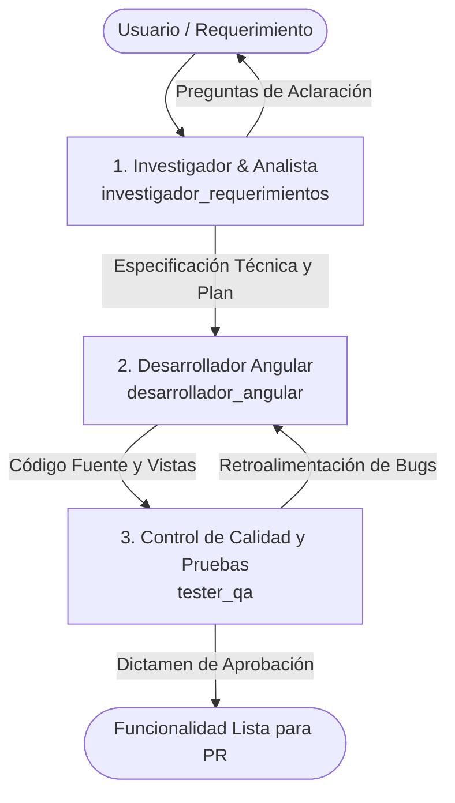

# Pipeline de Agentes de Desarrollo — MIS Host

Para garantizar el cumplimiento de los estándares de gobernanza, calidad y velocidad en **Financiera Confianza**, el ciclo de vida de cualquier funcionalidad o reporte en **MIS Host** es atendido por un equipo secuencial de **3 agentes especializados**:

---

## 1. Los Tres Agentes Especializados

| # | Agente | Identificador | Rol Principal | Herramientas Clave |
|---|---|---|---|---|
| **1** | [Investigador y Analista](./01-investigador-requerimientos.md) | `investigador_requerimientos` | Releva dudas, aclara con el usuario, revisa contratos y emite la especificación técnica | `ask_question`, lectura de `governance/docs/`, búsqueda de contratos |
| **2** | [Desarrollador Angular](./02-desarrollador-angular.md) | `desarrollador_angular` | Scaffolding canónico, componentes OnPush, reactividad Signals, PrimeNG 21 y Tailwind v4 | `crear-modulo.mjs`, edición de código, `ng build` |
| **3** | [Tester QA](./03-tester-qa.md) | `tester_qa` | Pruebas unitarias (Vitest), pruebas E2E (Playwright) y auditoría de gobernanza | `ejecutar-pruebas.mjs`, `validar-gobernanza.mjs` |

---

## 2. Flujo de Trabajo Detallado

### Fase 1: Investigación y Clarificación (Agente 1)
- Analiza la solicitud.
- Si el requerimiento omite filtros, contratos, endpoints o reglas de negocio, formula preguntas directas al usuario para despejar dudas.
- Consulta `governance/docs/` y pantallas de referencia.
- Entrega un **Documento de Especificación Técnica** con los modelos, contratos y lista de componentes/servicios a construir.

### Fase 2: Implementación y Codificación (Agente 2)
- Recibe la especificación técnica.
- Si es un módulo nuevo, ejecuta `node governance/scripts/crear-modulo.mjs <modulo>`.
- Codifica usando exclusivamente **Signals**, `ChangeDetectionStrategy.OnPush`, inyección con `inject()` y sintaxis moderna de control de flujo (`@if`, `@for`).
- Implementa los 4 estados de pantalla: cargando, vacío, error (con botón de reintento) y datos listos.
- Verifica que el proyecto compile limpiamente con `ng build`.

### Fase 3: Pruebas y Validación de Calidad (Agente 3)
- Recibe el código y escribe pruebas unitarias exhaustivas para `utils/*.mappers.spec.ts` y `services/*.service.spec.ts`.
- Ejecuta las pruebas mediante `node governance/scripts/ejecutar-pruebas.mjs unit`.
- Ejecuta la auditoría estática con `node governance/scripts/validar-gobernanza.mjs`.
- Emite el informe de pruebas certificando que no hay regresiones ni violaciones de aislamiento entre `core`, `shared` y `pages`.
