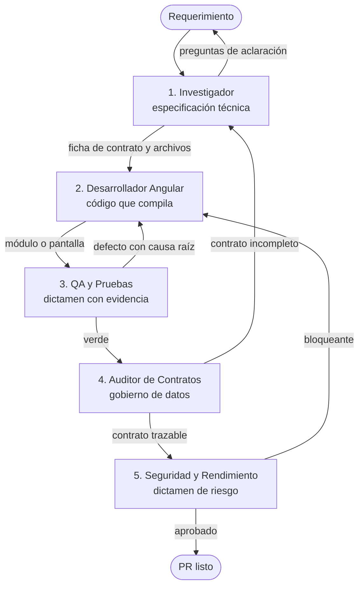

# Pipeline de Agentes — MIS Host

Cinco agentes secuenciales atienden el ciclo de vida de cualquier funcionalidad o reporte. Cada uno recibe un artefacto concreto y entrega otro: no son roles decorativos, son compuertas con criterio de rechazo.



---

## Los cinco agentes

| # | Agente | Entrega | Rechaza cuando… |
|---|---|---|---|
| **1** | [Investigador de requerimientos](./01-investigador-requerimientos.md) | Especificación técnica | falta `cod_rep`, jerarquía, fecha de corte o motor de reporte |
| **2** | [Desarrollador Angular](./02-desarrollador-angular.md) | Código que compila y respeta la arquitectura | la especificación es inviable o contradice el código real |
| **3** | [QA y pruebas](./03-tester-qa.md) | Dictamen con evidencia | vacío y error se confunden, o falta cobertura de los 4 casos |
| **4** | [Auditor de contratos y datos](./04-auditor-contratos-datos.md) | Contrato trazable y docs vigentes | el dato no significa lo documentado, o la doc quedó falsa |
| **5** | [Seguridad y rendimiento](./05-revisor-seguridad-rendimiento.md) | Dictamen de riesgo | se agregó un secreto, o un control de UI se presenta como autorización |

Las fases 4 y 5 son nuevas: antes el pipeline terminaba con las pruebas verdes, lo que garantizaba que el código funcionara pero no que **el dato significara lo que dice** ni que el cambio no ampliara la superficie de riesgo.

---

## Cómo se usan

Cada archivo trae frontmatter YAML (`name`, `description`, `tools`) y una sección **Prompt de sistema**. Se pueden usar de tres formas:

1. **Como subagente**: copiar el archivo a `.claude/agents/` (o el directorio que use tu herramienta) y invocarlo por su `name`.
2. **Como prompt directo**: pegar el bloque *Prompt de sistema* en cualquier asistente.
3. **Como checklist humano**: el cuerpo del documento es la guía de revisión, sin IA de por medio.

Las skills de `governance/skills/` están registradas en `.agents/skills.json` y las consumen tanto los agentes como las personas.

---

## Regla común a todos

**Cuando la documentación y el código discrepan, gana el código** — y el agente que detecta la discrepancia abre el hallazgo para corregir el documento. La auditoría del 2026-09-07 encontró cinco reglas que los agentes exigían y el repositorio nunca cumplió (ver [`auditoria-gobernanza-2026-09.md`](../docs/evidence/quality/auditoria-gobernanza-2026-09.md)); esa asimetría se corrige, no se hereda.

Comandos que todo agente puede correr:

```bash
npm run verify                                          # gobernanza + docs + tokens + inventarios
node governance/scripts/validar-gobernanza.mjs --listar  # catálogo de reglas con su porqué
node governance/scripts/ejecutar-pruebas.mjs help        # todos los comandos de verificación
```
