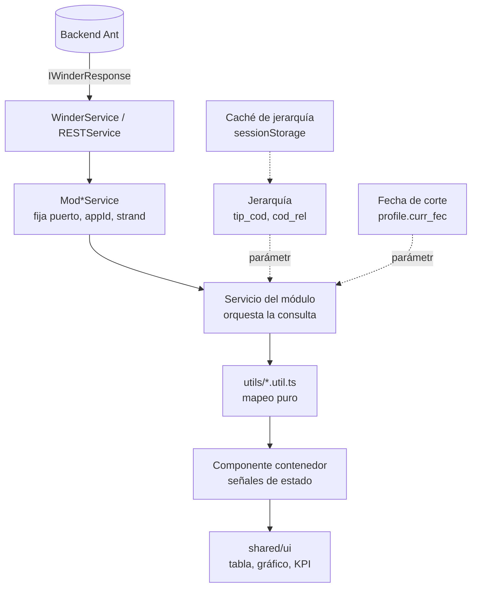

# Linaje del dato

De dónde sale una cifra y dónde puede corromperse antes de llegar a la pantalla.

## El recorrido



Nada salta capas. Una pantalla nunca habla con `WinderService` ni con `HttpClient`.

## Los cinco puntos donde una cifra se corrompe

Ninguno produce un error visible. Los cinco muestran un número plausible y equivocado.

### 1. Nivel de jerarquía incorrecto

El reporte se consulta con `PARAMS_HIER_OFICINA` cuando el negocio pedía unidad. La tabla se llena, las sumas cuadran internamente y el total no corresponde al alcance esperado.

**Control**: copiar la constante de un reporte del mismo dominio, nunca elegirla por intuición. Registrarla en la [ficha de reporte](../templates/report-spec-template.md). Ver [jerarquía organizativa](./contracts/organizational-hierarchy.md).

### 2. Fecha de corte ausente o en el formato equivocado

`BloqueReporteService.regular()` agrega `fec` automáticamente **salvo que el llamador ya haya enviado `fec` o `fecha`**. Un reporte que manda su propia fecha en el formato del otro motor obtiene datos de un día distinto, o ninguno.

**Control**: declarar en la ficha el nombre (`fec` / `fecha`), el formato y qué pasa si falta. La fecha sale de `profile.curr_fec`, no del reloj del navegador.

### 3. Error del backend presentado como tabla vacía

Ant responde **500 cuando un bloque no tiene datos**, lo que empuja a envolver todo en un `catchError` genérico. Hecho así, una caída real del backend se ve igual que "no hay información": el usuario reintenta filtros y nadie se entera.

**Control**: `regularTolerante()` absorbe únicamente el error que `esBloqueVacio()` reconoce. La regla `error-no-silenciado` del auditor marca los `catchError(() => of(…))` en servicios. Es el defecto documentado en la [comparación con el legado](../evidence/performance/legacy-comparison.md).

### 4. Caché de jerarquía sin invalidar

El caché evita que 44 pantallas repitan `base_hier` + `level_hier` en serie. Si su clave no incluye identidad, nodo y fecha de corte, **al cambiar a un usuario alterno se sirve el árbol del usuario anterior** y el reporte se consulta sobre nodos que no le corresponden.

**Control**: invalidar al cambiar de identidad; incluir identidad, nodo y fecha en la clave. Cubierto por la suite E2E de cambio de usuario y caché de jerarquía.

### 5. Mapeo que asume un tipo que el backend no garantiza

Ant devuelve montos como número **o** como cadena formateada (`'S/ 1,250.75'`), y campos ausentes como `null`. Un mapper que asume `number` produce `NaN`, y la pantalla muestra un guion donde iba una cifra.

**Control**: mapeos puros en `utils/` con specs que cubran número, cadena, `null`, `undefined` y objeto vacío. Es el caso de prueba obligatorio en la [guía de pruebas](../../skills/mis-testing-guide/SKILL.md).

## Trazar una cifra hacia atrás

Cuando alguien reporta un número dudoso, el orden que resuelve más rápido:

| Paso | Pregunta | Dónde se responde |
|---|---|---|
| 1 | ¿Qué pantalla y qué ruta? | [inventario de módulos](../architecture/module-inventory.md) |
| 2 | ¿Qué `cod_rep` consulta? | `constantes/` del módulo, [catálogo](./catalog.md) |
| 3 | ¿Qué nodo de jerarquía se envió? | `PARAMS_HIER_*` del componente |
| 4 | ¿Qué fecha de corte? | `profile.curr_fec` del usuario activo |
| 5 | ¿El mapeo alteró el valor? | `utils/*.util.ts` y su spec |
| 6 | ¿La cifra ya venía mal de Ant? | **acá termina el frontend**: escalar al backend |

Los pasos 1 a 5 se resuelven en este repositorio. El paso 6 no: si el dato llega mal del backend, el frontend lo presenta fielmente y la corrección pertenece a quien lo produce.

## Linaje interno del cliente

Datos que el frontend origina, y que también tienen recorrido:

```text
elección del usuario → PreferenciasService → repositorio localStorage → variables CSS en <html>
navegación           → RecientesService    → preferencias             → accesos rápidos del Home
login Ant            → AuthService         → sessionStorage           → authGuard e interceptores
```

Ninguno transporta autorización, y ninguno debe sobrevivir al cierre de sesión.
