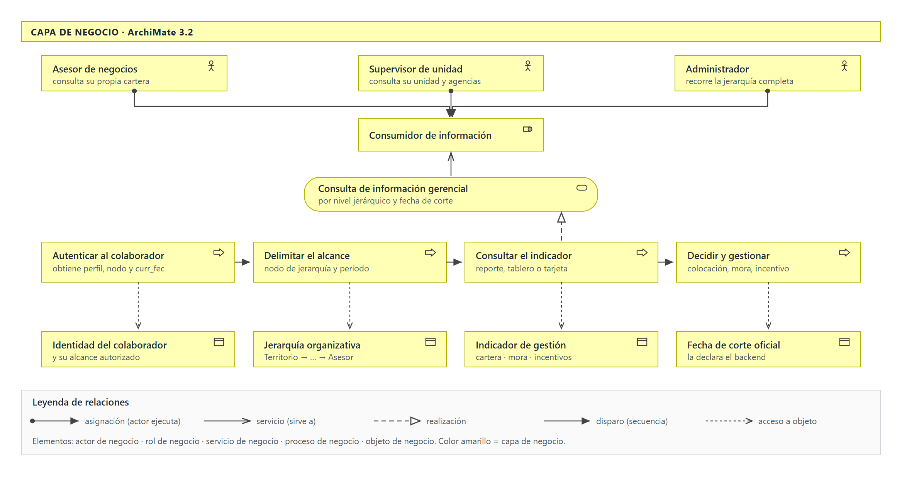
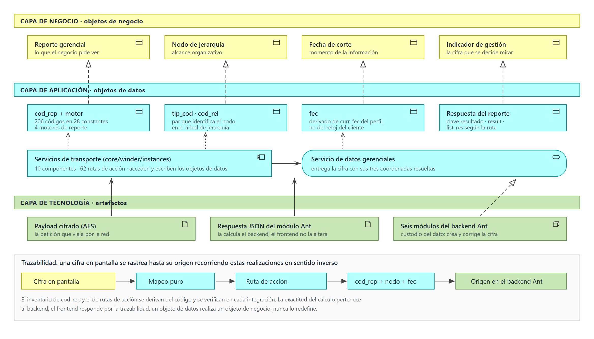
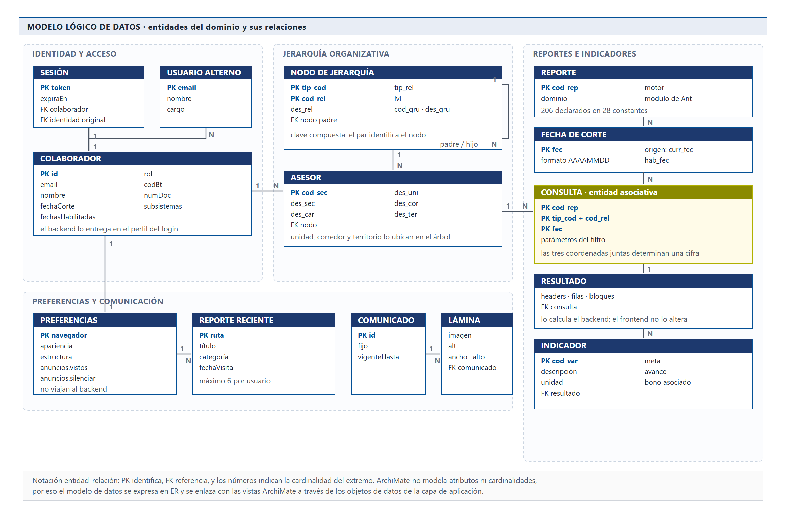
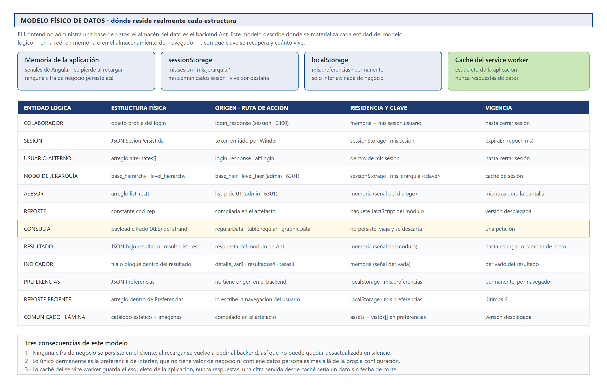
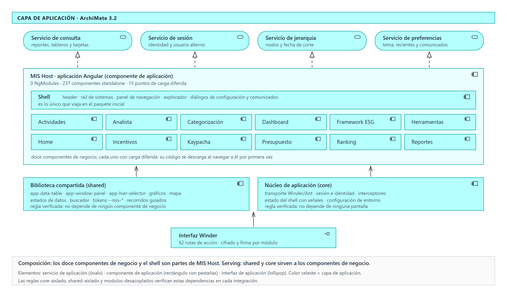
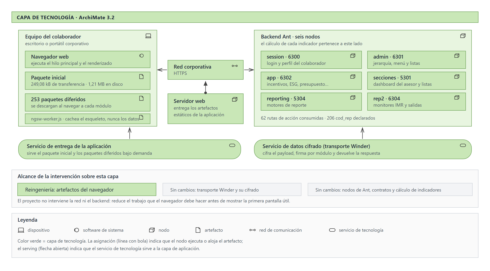
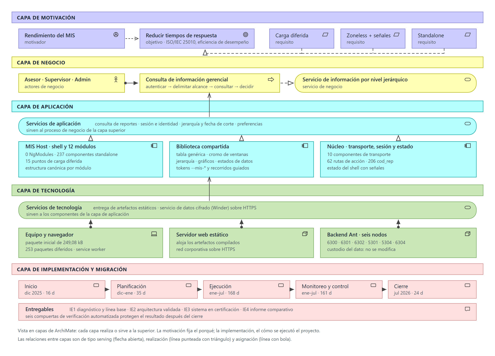

# CAPÍTULO 3: DESARROLLO DEL PROYECTO

En este capítulo se presenta el diseño de la solución propuesta, su implementación sobre el Sistema de Información Gerencial (MIS) de la entidad, la gestión aplicada durante el proyecto y la validación de los resultados obtenidos. El diseño se expone con la notación ArchiMate 3.2, recorriendo sus capas de negocio, aplicación y tecnología, y cerrando con la vista en capas que las integra junto con la motivación y la implementación; el desarrollo describe las decisiones técnicas adoptadas y su justificación; la gestión documenta los artefactos de conducción del proyecto; y la validación contrasta el comportamiento del sistema heredado con el del sistema implementado bajo el modelo de calidad ISO/IEC 25010:2023.

## 3.1 DISEÑO DE LA SOLUCIÓN

Las vistas de esta sección están modeladas en **ArchiMate 3.2**, el lenguaje de modelado de arquitectura empresarial de The Open Group. Se eligió por dos razones: separa explícitamente lo que el negocio necesita de lo que la aplicación ofrece y de lo que la tecnología ejecuta —que es justamente la separación que este proyecto interviene en una sola de sus capas—, y tipifica las relaciones, de modo que una flecha no significa "se conecta con" sino una relación concreta y verificable.

Se usan cinco capas del lenguaje, cada una con su color convencional: **negocio** (amarillo), **aplicación** (celeste), **tecnología** (verde), **motivación** (violeta) e **implementación y migración** (rosa). Las relaciones empleadas son cinco:

**Tabla 1.** *Relaciones ArchiMate utilizadas en las vistas*

| Relación | Notación | Qué afirma |
|---|---|---|
| Asignación | línea con bola en el origen y punta en el destino | un elemento activo ejecuta a otro: el actor ejecuta el proceso, el nodo aloja el artefacto |
| Servicio (*serving*) | línea con punta abierta | un elemento ofrece su funcionalidad a otro: el servicio de aplicación sirve al proceso de negocio |
| Realización | línea punteada con triángulo hueco | un elemento concreto materializa a uno abstracto: el componente realiza el servicio |
| Disparo (*triggering*) | línea con punta rellena | secuencia temporal entre procesos |
| Acceso | línea punteada con punta abierta | un proceso o función lee o escribe un objeto |

Una advertencia metodológica que conviene dejar sentada: **ArchiMate no tiene una "capa de datos"**. Los objetos de negocio pertenecen a la capa de negocio, los objetos de datos a la de aplicación y los artefactos a la de tecnología, y lo que los vincula es una cadena de realizaciones. Por eso la sección 3.1.2 no describe una capa propia, sino cómo esa cadena atraviesa las tres.

El diseño parte, además, de una restricción que condiciona todas las decisiones posteriores: **la reingeniería alcanza únicamente a la capa de presentación**. El backend Ant, sus contratos de datos y la lógica de cálculo de los indicadores de negocio permanecen sin modificación. Esta delimitación protege la continuidad operativa de la entidad, porque el sistema heredado y el sistema propuesto consumen exactamente las mismas fuentes durante todo el período de transición.

### 3.1.1 Capa de negocio

La vista de negocio (Figura 1) identifica tres **actores** —asesor, supervisor y administrador— asignados a un mismo **rol**, el de consumidor de información gerencial. Ese rol recibe un **servicio de negocio**, la consulta de información por nivel jerárquico y fecha de corte, que es realizado por una cadena de cuatro **procesos de negocio** encadenados por relaciones de disparo. Cada proceso accede a los **objetos de negocio** que necesita.

La operación de la entidad se apoya en una estructura territorial jerárquica que canaliza las atribuciones comerciales de forma descendente, desde la oficina central hacia los niveles de Territorio, Corredor, Unidad y Agencia, hasta llegar al Asesor. Esa jerarquía no es solo organizativa: es el mecanismo con el que el sistema delimita **qué información puede ver cada usuario y a qué nivel de agregación**.

El proceso de negocio que soporta el MIS puede describirse en cuatro momentos:

1. **Autenticación e identificación del alcance.** El colaborador ingresa con su cuenta corporativa. El backend responde con su perfil, del que se derivan su código de negocio, su nodo de jerarquía y la fecha de corte oficial de la información.
2. **Selección del alcance de consulta.** El usuario elige el nodo organizativo y, cuando corresponde, el período. Un asesor consulta su propia cartera; un supervisor, la de su unidad; un administrador puede recorrer la jerarquía completa.
3. **Consulta y visualización del indicador.** El sistema solicita al backend el reporte identificado por su código, con el nodo y la fecha de corte, y presenta el resultado en tablas, gráficos o tarjetas de indicador.
4. **Decisión y gestión.** El resultado sustenta la gestión comercial: seguimiento de colocaciones, control de mora, evaluación de incentivos y priorización de cartera.

**Figura 1**

*Vista de la capa de negocio: actores, rol, servicio, procesos y objetos de negocio*

*Nota.* Modelado en ArchiMate 3.2. Los tres actores se asignan a un mismo rol; la cadena de procesos realiza el servicio de negocio y accede a los objetos que el negocio reconoce. Elaboración propia.

El punto crítico de este proceso —y el que justifica el proyecto— está en el tercer momento. La información se consume en jornada operativa, frecuentemente en campo y sobre equipos de gama media. Un tiempo de respuesta elevado no solo incomoda: desplaza la consulta fuera del momento en que la decisión se toma.

### 3.1.2 Arquitectura de datos

La Figura 2 muestra cómo un mismo hecho del negocio se representa en las tres capas. Un objeto de negocio como el *indicador de gestión* es realizado por objetos de datos de la capa de aplicación —`cod_rep`, el par `tip_cod`/`cod_rel`, `fec` y la respuesta del reporte—, y estos a su vez se materializan en artefactos de la capa de tecnología: el payload cifrado que viaja por la red y la respuesta que calcula el backend. Leer esa cadena en sentido inverso es, literalmente, el procedimiento de trazabilidad.

El sistema no crea ni corrige datos de negocio: los transforma para presentarlos. Esta condición es una decisión de arquitectura, no una limitación técnica, y se sostiene en el principio de que el custodio del dato es el backend. Toda corrección de una cifra pertenece al origen.

Un dato del MIS queda determinado por tres coordenadas, y **las tres son obligatorias**:

**Tabla 2.** *Coordenadas que determinan un dato del MIS*

| Coordenada | Parámetros | Qué delimita |
|---|---|---|
| Qué | `cod_rep` y motor de reporte | identifica la consulta |
| De dónde | `tip_cod`, `cod_rel` | delimita el alcance organizativo |
| De cuándo | `fec` (derivado de `curr_fec` del perfil) | fija el momento de la información |

Faltando cualquiera de las tres, la cifra resultante es plausible y equivocada: una tabla que se pinta correctamente puede estar mostrando el dato de una agencia cuando el negocio esperaba el de una unidad. Es el modo de falla más costoso del sistema y ninguna prueba unitaria lo detecta por sí sola.

El inventario de activos de datos derivado del código del sistema implementado comprende:

- **206 códigos de reporte (`cod_rep`)** únicos, declarados en 28 archivos de constantes y agrupados por dominio de negocio.
- **62 rutas de acción** del backend Ant, distribuidas en 10 servicios de transporte, cada una con sus parámetros de payload y su clave de respuesta.
- **Cuatro motores de reporte**: `regularData` para tablas multiencabezado, `table.regular` para columnas dinámicas, `graphicData` para bloques gráficos y `reportData`, conservado solo por compatibilidad con el sistema heredado.
- **Trece dominios de datos**, cada uno con su módulo de backend, su puerto y su servicio de acceso.

**Figura 2**

*Cadena de realización entre objetos de negocio, objetos de datos y artefactos*

*Nota.* Modelado en ArchiMate 3.2. ArchiMate no define una capa de datos: el objeto de datos realiza al objeto de negocio y el artefacto lo materializa en la capa de tecnología. Elaboración propia.

#### Modelo lógico

La Figura 3 presenta el modelo lógico de entidades: qué cosas distingue el sistema, con qué atributos las identifica y cómo se relacionan. Se agrupa en cuatro áreas temáticas —identidad y acceso, jerarquía organizativa, reportes e indicadores, y preferencias y comunicación— y se expresa en notación entidad-relación, no en ArchiMate, porque ArchiMate no modela atributos ni cardinalidades.

Tres entidades merecen atención:

- **NODO DE JERARQUÍA** tiene **clave compuesta** (`tip_cod` + `cod_rel`) y una relación consigo misma: el árbol organizativo se representa por adyacencia, cada nodo apunta a su padre.
- **CONSULTA** es una **entidad asociativa**: no existe en el backend como tabla, pero es indispensable en el modelo porque solo la combinación de reporte, nodo y fecha de corte determina una cifra. Es la formalización, en lenguaje de datos, de las tres coordenadas de la Tabla 2.
- **ASESOR** conserva `des_uni`, `des_cor` y `des_ter`, que son los tres niveles superiores del árbol denormalizados en la propia fila; el backend los entrega así, y el frontend los preserva para poder ubicar al colaborador sin recorrer la jerarquía.

**Figura 3**

*Modelo lógico de datos: entidades, atributos y relaciones*

*Nota.* Derivado de los modelos de `src/app/**/models/` y de las respuestas de las rutas de acción. PK identifica, FK referencia y los números expresan la cardinalidad. Elaboración propia.

#### Modelo físico

El modelo físico responde una pregunta distinta: dónde reside realmente cada estructura. Y acá hay que decir algo que condiciona todo el diseño: **este sistema no administra una base de datos**. El almacén del dato es el backend Ant; el frontend solo materializa las entidades en tres lugares, con vigencias muy distintas.

**Figura 4**

*Modelo físico de datos: estructura, origen, residencia y vigencia de cada entidad*

*Nota.* Las claves de almacenamiento (`mis.sesion`, `mis.jerarquia.*`, `mis.preferencias`, `mis.comunicados.sesion`) son las declaradas en el código. Elaboración propia.

De ese modelo se desprenden tres consecuencias que conviene dejar explícitas, porque son decisiones y no accidentes:

1. **Ninguna cifra de negocio se persiste en el cliente.** Al recargar se vuelve a pedir al backend. Un dato financiero guardado en el navegador podría quedar desactualizado sin que nada lo advierta, y además viajaría fuera del control del servidor.
2. **Lo único permanente es la preferencia de interfaz**, que no tiene valor de negocio: tema, fondo, acento, disposición del menú y la lista de reportes recientes.
3. **La caché del *service worker* guarda el esqueleto de la aplicación, nunca respuestas.** Una cifra servida desde caché sería un dato sin fecha de corte, que es precisamente el modo de falla que el gobierno del dato busca impedir.

Los nombres del contrato se conservan sin traducir en el borde de la aplicación (`cod_rep`, `tip_cod`, `cod_rel`, `fec`). Renombrarlos en la capa de transporte habría hecho imposible rastrear una cifra hasta su origen sin un diccionario intermedio.

### 3.1.3 Capa de aplicación

En la vista de aplicación (Figura 5), MIS Host es un **componente de aplicación** que se compone del shell y de doce componentes de negocio, y que **realiza** cuatro **servicios de aplicación**: consulta, sesión, jerarquía y preferencias. La biblioteca compartida y el núcleo **sirven** a esos componentes, y el acceso al backend se expresa como una **interfaz de aplicación**, la interfaz Winder.

Internamente, esa composición se organiza en tres capas de código con dependencias dirigidas en un solo sentido:

**Tabla 3.** *Capas de la aplicación y su regla de dependencia*

| Capa | Contenido | Regla de dependencia |
|---|---|---|
| `core` | transporte, sesión, interceptores, configuración de entorno, estado del shell | no depende de ninguna pantalla |
| `shared` | biblioteca de componentes de interfaz, servicios transversales y utilidades | no depende de ningún módulo de negocio |
| `pages` | el shell de la aplicación y los doce módulos de negocio | depende de `core` y `shared`, nunca de otro módulo par |

Esta direccionalidad no se sostiene por convención: está verificada automáticamente por tres reglas de auditoría (`core-aislado`, `shared-aislado` y `modulos-desacoplados`) que se ejecutan en cada verificación del proyecto y bloquean la integración ante una violación nueva.

Los doce módulos de negocio enlazados son Actividades, Analista, Categorización, Dashboard, Framework ESG, Herramientas, Home, Incentivos, Kaypacha, Presupuesto, Ranking y Reportes. Cada uno declara su propio archivo de rutas y se incorpora al enrutador principal mediante carga diferida: el código de un módulo solo se descarga cuando el usuario navega a él por primera vez.

Dentro de cada módulo se aplica una estructura canónica —`constantes/`, `models/`, `services/`, `utils/`, `ui/` y `components/`— que separa la configuración del contrato, el contrato del acceso a datos, el acceso de la transformación y la transformación de la presentación. Las utilidades de transformación son funciones puras, lo que permite probarlas sin instanciar la aplicación.

**Figura 5**

*Vista de la capa de aplicación: servicios, componentes e interfaz*

*Nota.* Modelado en ArchiMate 3.2. El anidamiento expresa composición; las reglas `core-aislado`, `shared-aislado` y `modulos-desacoplados` verifican en cada integración las relaciones de servicio dibujadas. Elaboración propia.

### 3.1.4 Capa de tecnología

La vista de tecnología (Figura 6) modela el **dispositivo** del colaborador y el **software de sistema** que lo ejecuta —el navegador—, los **artefactos** que este descarga, el **nodo** que los entrega, la **red de comunicación** que los transporta y los seis **nodos** del backend Ant. Los dos **servicios de tecnología** que sostienen la capa de aplicación son la entrega de artefactos estáticos y el servicio de datos cifrado.

La Tabla 4 contrasta la plataforma del sistema heredado con la del sistema implementado. Las versiones corresponden a las declaradas en los manifiestos de dependencias de ambos repositorios.

**Tabla 4.** *Comparación de plataformas tecnológicas*

| Aspecto | Sistema heredado | Sistema implementado |
|---|---|---|
| Framework | Angular 14.2.5 | Angular 22.0.6 |
| Detección de cambios | Zone.js 0.11.4 | zoneless, con señales |
| Organización | 312 módulos declarados (`NgModule`) | 0 módulos declarados; componentes standalone |
| Biblioteca de interfaz | Angular Material 14.2.4 | PrimeNG 21.1.9 + Tailwind CSS v4 |
| Programación reactiva | RxJS 6.6.7 | RxJS 7.8 y señales de Angular |
| Archivos TypeScript | 827 | 936 |
| Transporte de datos | Winder sobre backend Ant | Winder sobre backend Ant (sin cambios) |
| Pruebas automatizadas | sin suite versionada | 356 archivos unitarios + 30 suites E2E |

La decisión de conservar el transporte Winder merece una justificación explícita: es el componente que cifra el payload y firma la petición contra cada módulo de Ant. Sustituirlo habría convertido una reingeniería de presentación en una intervención de integración, con impacto en seis servicios de backend y sin ningún beneficio para el objetivo de rendimiento.

El despliegue se realiza como aplicación estática con *service worker* registrado, lo que permite cachear el esqueleto de la aplicación sin cachear respuestas de datos —una decisión deliberada, porque una cifra financiera servida desde caché sería un dato sin fecha de corte.

**Figura 6**

*Vista de la capa de tecnología: dispositivo, artefactos, nodos y servicios*

*Nota.* Modelado en ArchiMate 3.2. El proyecto interviene los artefactos que el navegador ejecuta; los nodos del backend y la red quedan fuera del alcance. Elaboración propia.

### 3.1.5 Vista en capas

La Figura 7 es la vista en capas de ArchiMate: cada capa realiza o sirve a la superior, y se suman dos capas que las anteriores no muestran. La de **motivación** declara el porqué del proyecto —el motivador *rendimiento del MIS*, el objetivo *reducir los tiempos de respuesta* medido con ISO/IEC 25010, y los tres requisitos que lo realizan: carga diferida, ejecución zoneless con señales y componentes standalone—. La de **implementación y migración** muestra los cinco paquetes de trabajo del proyecto y sus entregables, que son los indicadores de éxito IE1 a IE4.

Leída de arriba abajo, articula las cuatro vistas anteriores en el recorrido completo de una consulta: el proceso de negocio determina qué indicador se necesita; la arquitectura de datos fija las tres coordenadas que lo identifican; la de aplicaciones resuelve qué módulo se carga y qué componentes lo presentan; y la tecnológica sostiene la ejecución.

Tres decisiones atraviesan las cuatro vistas y explican el resultado del proyecto:

1. **La carga se difiere hasta el momento de uso.** Ningún módulo de negocio forma parte del paquete inicial. Un asesor que solo consulta su cartera nunca descarga el código de Presupuesto ni el de ESG.
2. **La actualización de la interfaz es granular.** Al eliminar Zone.js, el framework deja de verificar toda la aplicación ante cada evento asíncrono y actualiza únicamente los consumidores de la señal que cambió.
3. **El contrato de datos es inmutable para este proyecto.** Lo que se optimiza es el camino entre la respuesta del backend y el píxel, no la respuesta.

**Figura 7**

*Vista en capas: motivación, negocio, aplicación, tecnología e implementación*

*Nota.* Modelado en ArchiMate 3.2. Cada capa realiza o sirve a la superior; la motivación declara el porqué del proyecto y la implementación, los paquetes de trabajo con los que se ejecutó. Elaboración propia.

## 3.2 DESARROLLO DE LA SOLUCIÓN

### 3.2.1 Estrategia de migración y convivencia

La migración se ejecutó por módulos y no por reescritura total. El sistema heredado se mantuvo operativo durante todo el proyecto, y cada módulo migrado se incorporó al nuevo portal conservando la ruta y el vocabulario que el usuario ya conocía. Esta convivencia impuso una condición de trabajo que resultó ser la más valiosa del proyecto: **el código heredado es la especificación**.

Antes de implementar una pantalla se recuperaba su equivalente en el sistema anterior y se extraía de él, de forma textual, la lista de columnas con su etiqueta visible y su clave de dato, la ruta de acción del backend con sus parámetros y las reglas de visibilidad por rol. Cuando el repositorio heredado no estaba disponible, la misma información se recuperó del historial de versiones del propio proyecto.

Este procedimiento evitó una clase completa de defectos. Una columna atada a una clave que el backend no devuelve compila sin error, pasa las pruebas y se muestra vacía en producción: solo el contraste contra la fuente lo detecta antes del despliegue.

### 3.2.2 Núcleo de la aplicación

El núcleo concentra lo que todos los módulos necesitan y ningún módulo debe reimplementar:

- **Transporte.** Diez servicios, uno por módulo de Ant, exponen las 62 rutas de acción del backend. Cada servicio declara su puerto y su identificador de aplicación; el cifrado del payload y la construcción de la petición son responsabilidad de la capa de transporte, no de la pantalla.
- **Sesión e identidad.** La autenticación se realiza contra la cuenta corporativa y la sesión se mantiene con un tiempo de vigencia acotado. El sistema soporta además la operación como usuario alterno, que permite a un supervisor consultar la información de un colaborador a su cargo conservando el registro de la identidad original.
- **Estado del shell.** El estado que comparten todas las pantallas —usuario activo, nodo de jerarquía, estado de carga global, preferencias de interfaz— se expone mediante señales de solo lectura. Las pantallas leen; solo el servicio propietario escribe.
- **Manejo de errores.** Un interceptor centraliza la respuesta ante fallos de red y de autorización, de modo que ninguna pantalla tenga que decidir por su cuenta qué hacer ante un 401.

### 3.2.3 Modularización y carga diferida

El enrutador principal declara quince puntos de carga diferida. Ninguno de ellos referencia directamente un componente de negocio: todos devuelven una promesa que el framework resuelve en el momento de la navegación.

El efecto sobre el artefacto de despliegue es medible y constituye la evidencia central del objetivo específico OE3:

**Tabla 5.** *Composición del artefacto de producción*

| Métrica | Valor |
|---|---|
| Paquete inicial (tamaño en disco) | 1,21 MB |
| Paquete inicial (transferencia estimada) | **249,08 kB** |
| Paquetes de carga diferida | 253 |
| Archivos JavaScript en el artefacto | 278 |

La cifra relevante para el usuario es la de transferencia: 249,08 kB es lo que el navegador descarga antes de poder pintar la primera pantalla útil. El resto del sistema —los doce módulos de negocio, los motores de reporte, las bibliotecas de gráficos y de mapas— viaja solo cuando se lo necesita.

El presupuesto de tamaño está declarado en la configuración de compilación y se verifica en cada construcción de producción: una regresión que engorde el paquete inicial rompe la compilación en lugar de llegar silenciosamente al usuario.

### 3.2.4 Reactividad granular y ejecución zoneless

La aplicación se ejecuta sin Zone.js. En el modelo anterior, cada evento asíncrono —una petición, un temporizador, un clic— disparaba un ciclo de verificación sobre el árbol completo de componentes, aun cuando el estado no hubiera cambiado. Con señales, el framework conoce exactamente qué consumidores dependen de cada valor y actualiza solo esa porción de la interfaz.

Esto no se limitó a un cambio de mecanismo: obligó a reordenar el estado de las pantallas. El patrón adoptado en los doce módulos es uniforme —el servicio del módulo publica señales de datos, carga y error; la pantalla las consume; los valores derivados se calculan con `computed` en lugar de recalcularse en la plantilla.

### 3.2.5 Componentes compartidos y sistema visual

La biblioteca compartida agrupa los componentes que aparecen en más de un módulo: tabla genérica con búsqueda y filtros por columna, tablas de reporte, selector de jerarquía, gráficos, mapa, buscador y los cuatro estados de una vista de datos. Los componentes reciben datos por entradas y emiten eventos por salidas; no conocen roles, códigos de reporte ni rutas del backend.

El sistema visual se apoya en 47 variables de color declaradas en una hoja de tokens, con su equivalencia para el tema oscuro. El color nunca se escribe como valor fijo en un componente: un hexadecimal literal no acompaña el cambio de tema ni el acento que el usuario elige, y una regla de auditoría lo señala.

Sobre la experiencia de uso se incorporaron además dos elementos que reducen la fricción de la transición desde el sistema anterior: un cromo de ventana uniforme para paneles y diálogos, y recorridos guiados que explican cada mejora sobre la interfaz real.

### 3.2.6 Gobierno del dato y aseguramiento automatizado

El aporte diferencial del proyecto respecto de una migración convencional es que la corrección del sistema no depende de la disciplina de quien programa, sino de compuertas que se ejecutan solas.

Se implementó un marco de gobierno con cuatro componentes:

1. **Documentación canónica del dato**: glosario de términos del contrato, catálogo de dominios y códigos de reporte, contratos del borde, linaje, clasificación por sensibilidad y asignación de responsabilidades.
2. **Inventarios derivados del código**: el catálogo de códigos de reporte, el inventario de rutas de acción y el de módulos y pruebas no se escriben a mano; se generan desde el código y se verifican en cada integración. Un inventario escrito a mano miente en el primer commit siguiente.
3. **Motor de reglas de arquitectura**: catorce reglas verifican aislamiento de capas, ausencia de secretos, distinción entre estado vacío y error, uso de tokens de color, existencia de pruebas vecinas y convenciones de nombres. Las reglas distinguen error de aviso, y la deuda anterior a su adopción quedó congelada en una línea base para poder exigir “cero hallazgos nuevos” desde el primer día sin detener el proyecto.
4. **Seis compuertas de verificación** encadenadas en un solo comando, que se ejecutan en segundos antes de cada integración.

**Tabla 6.** *Compuertas de verificación automatizada*

| Compuerta | Qué protege | Modo de falla que evita |
|---|---|---|
| Gobernanza de arquitectura | invariantes de capas y seguridad | un import que rompe el aislamiento |
| Documentación | que la documentación describa el código | una guía que enseña una ruta inexistente |
| Tokens de diseño | sincronía entre la hoja de tokens y su derivado | medir contraste sobre un valor obsoleto |
| Inventarios | catálogos derivados al día | un inventario que cuenta un módulo retirado |
| Anclas de recorridos guiados | que cada paso apunte a un elemento real | un recorrido con pasos que se saltean en silencio |
| Activos | integridad y peso de las imágenes servidas | una imagen que responde 404 en producción |

Las dos últimas compuertas cubren modos de falla que no rompen la compilación ni ninguna prueba; sin verificación explícita llegan a producción sin que nadie los advierta.

Sobre la calidad del dato, el proyecto delimita con precisión su alcance: **la exactitud de la cifra no es verificable desde el frontend**. Si el backend calcula mal, el sistema presenta fielmente el cálculo equivocado. Lo que sí se verifica es la validez del payload, la completitud de la respuesta, la distinción entre vacío legítimo y fallo, la oportunidad respecto de la fecha de corte y la trazabilidad hasta el código de reporte de origen.

## 3.3 GESTIÓN DEL PROYECTO

### 3.3.1 Alcance del proyecto

El alcance se estructuró en cinco fases —inicio, planificación, ejecución, monitoreo y control, y cierre— desagregadas en paquetes de trabajo. Cada paquete corresponde a un incremento verificable del sistema y se descompone en tareas asignables dentro de una iteración.

**Incluido en el alcance**: diagnóstico del sistema heredado; diseño de la arquitectura modular; migración de los doce módulos de negocio; biblioteca de componentes compartidos y sistema visual; suite de pruebas automatizadas; marco de gobierno del dato y compuertas de verificación; despliegue en el entorno de certificación; informe comparativo de rendimiento.

**Excluido del alcance**, y declarado explícitamente para evitar expectativas no cumplidas:

- Modificación del backend Ant, de sus contratos o de la lógica de cálculo de los indicadores.
- Sustitución del transporte Winder o de su esquema de cifrado.
- Intervención sobre la infraestructura de red, enlaces o proveedores de conectividad.
- Corrección de datos de negocio: el frontend no crea ni corrige cifras.
- Migración de los reportes del sistema heredado que no estén en el catálogo priorizado.

**Criterios de aceptación**: un módulo se considera terminado cuando presenta los cuatro estados de datos —resultado, vacío legítimo, fallo de backend y payload malformado—, cuenta con pruebas que distinguen el segundo del tercero, atraviesa las seis compuertas de verificación y su contrato quedó registrado en el catálogo de datos.

### 3.3.2 Hoja de ruta del proyecto

El proyecto se ejecutó entre el 01/12/2025 y el 31/07/2026. La hoja de ruta ordenó el trabajo en cuatro tramos: estabilización de la base técnica; refactorización del núcleo; migración de los módulos de mayor uso; y escalado al resto del catálogo, con el monitoreo y el control corriendo en paralelo desde la segunda fase.

La secuencia respondió a una regla de dependencia: ningún módulo de negocio se migró antes de que el núcleo —transporte, sesión y estado— estuviera estabilizado, porque cada módulo migrado sobre un núcleo inestable habría tenido que migrarse dos veces.

### 3.3.3 Lista de hitos

**Tabla 7.** *Hitos de control del proyecto*

| Hito | Entregable verificable | Fecha comprometida |
|---|---|---|
| H1 — Proyecto constituido | acta de constitución aprobada e interesados identificados | 16/12/2025 |
| H2 — Arquitectura aprobada | documento de arquitectura validado por especialistas (IE2) | 20/01/2026 |
| H3 — Contención de seguridad ejecutada | rotación de claves criptográficas expuestas | 27/01/2026 |
| H4 — Núcleo refactorizado | transporte, sesión y estado con señales, en zoneless | 24/02/2026 |
| H5 — Verificación automatizada en marcha | compuertas integradas al flujo de integración | 10/02/2026 |
| H6 — Primer bloque de módulos migrado | Home, Dashboards, Actividades y Presupuesto | 21/04/2026 |
| H7 — Catálogo completo migrado | los ocho módulos restantes en certificación (IE3) | 07/07/2026 |
| H8 — Validación de rendimiento | informe comparativo contra la línea base (IE4) | 23/07/2026 |
| H9 — Cierre | transferencia de conocimiento y cierre administrativo | 31/07/2026 |

### 3.3.4 Matriz de asignación de responsabilidades

Se adoptó una matriz RACI sobre los paquetes de trabajo. Los roles corresponden a los recursos presupuestados: Responsable de Analítica, Analista de Desarrollo y Analista de Base de Datos, con la jefatura del área como autoridad de aprobación.

**Tabla 8.** *Matriz RACI por paquete de trabajo*

| Paquete de trabajo | Resp. Analítica | Analista Desarrollo | Analista BD | Jefatura |
|---|---|---|---|---|
| Diagnóstico y línea base | A | R | C | I |
| Diseño de la arquitectura | A | R | C | I |
| Refactorización del núcleo | A | R | C | I |
| Migración de módulos | A | R | C | I |
| Contratos de datos y catálogo | C | R | A | I |
| Pruebas y compuertas | A | R | C | I |
| Validación de rendimiento | R | C | C | A |
| Cierre y transferencia | R | C | C | A |

*R: ejecuta · A: aprueba · C: consultado · I: informado*

### 3.3.5 Gestión de la calidad

La gestión de calidad se apoyó en tres referencias normativas y en un mecanismo de verificación propio.

- **ISO/IEC 25010:2023** aporta el modelo de calidad del producto. La característica bajo evaluación es **eficiencia de desempeño**, con sus subcaracterísticas de comportamiento temporal y utilización de recursos.
- **ISO/IEC 12207** aporta la organización del ciclo de vida y los puntos de revisión entre fases.
- **ISO/IEC 25012** aporta las dimensiones de calidad del dato que se aplicaron al gobierno del dato descrito en 3.2.6.

El aseguramiento se ejerce en tres niveles: revisión de código sobre cada cambio; pruebas automatizadas —356 archivos de prueba unitaria y 30 suites end-to-end ejecutadas en dos perfiles de dispositivo, escritorio y móvil—; y las seis compuertas de verificación, que bloquean la integración ante un hallazgo nuevo.

La política de pruebas es explícita respecto de qué debe cubrirse: todo servicio que traiga datos prueba los cuatro casos —respuesta con datos, vacío legítimo, fallo de backend y payload malformado—. Los dos del medio son los que importan, porque confundir “sin datos” con “falló la consulta” es el defecto que degradó la confianza en el sistema heredado.

### 3.3.6 Gestión de los riesgos

**Tabla 9.** *Registro de riesgos del proyecto*

| ID | Riesgo | Prob. | Impacto | Respuesta |
|---|---|---|---|---|
| R1 | Exposición de claves criptográficas del transporte en el repositorio | Alta | Crítico | Mitigar: rotación de claves como primera actividad de ejecución (H3) y control del artefacto de producción en cada compilación |
| R2 | Divergencia funcional entre el módulo migrado y el heredado | Alta | Alto | Mitigar: el código heredado como especificación; contraste columna por columna antes de cerrar cada módulo |
| R3 | Cambio de contrato en el backend durante la migración | Media | Alto | Transferir: el cambio de contrato exige decisión del backend y plan de migración; el frontend no lo absorbe con mapeos |
| R4 | Regresión de rendimiento al incorporar módulos | Media | Alto | Mitigar: presupuesto de tamaño verificado en cada compilación de producción |
| R5 | Indisponibilidad del entorno de certificación para medir | Media | Medio | Mitigar: protocolo de medición reproducible y ventana de medición acordada con el área técnica |
| R6 | Pérdida de conocimiento por rotación del equipo | Baja | Alto | Mitigar: documentación versionada junto al código y verificada automáticamente |
| R7 | Resistencia del usuario al cambio de interfaz | Media | Medio | Mitigar: conservación de rutas y vocabulario del sistema anterior; recorridos guiados sobre las pantallas nuevas |

La reserva de contingencia de S/ 16 478,00 —10 % de la línea base de costos— responde a este registro y no a un porcentaje arbitrario.

### 3.3.7 Gestión de los recursos y adquisiciones

El equipo se conformó con tres perfiles: un Responsable de Analítica, un Analista de Desarrollo y un Analista de Base de Datos. No se requirió contratación externa, dado que la organización contaba con los perfiles y sus herramientas de trabajo.

Las adquisiciones se limitaron a lo que el proyecto no podía resolver con infraestructura existente: capacidad de servidores por ocho meses, licencias de software y equipamiento portátil para el equipo. No se adquirieron servicios de terceros para el desarrollo, y el marco de verificación se construyó sin dependencias fuera de las ya presentes en el proyecto, decisión que evitó sumar costo recurrente y riesgo de proveedor.

### 3.3.8 Gestión del costo y del cronograma

**Tabla 10.** *Línea base de costos del proyecto (soles)*

| Tipo | Recurso | Horas | Costo unitario | Total |
|---|---|---:|---:|---:|
| Humano | Analista de Base de Datos | 1 280 | 22,00 | 28 160,00 |
| Humano | Analista de Desarrollo | 2 560 | 22,00 | 56 320,00 |
| Humano | Responsable de Analítica | 960 | 50,00 | 48 000,00 |
| Material | Laptops corporativas (3) | — | 2 500,00 | 7 500,00 |
| Tecnológico | Servidores (8 meses) | — | 2 500,00 | 20 000,00 |
| Tecnológico | Software y licencias (4) | — | 1 200,00 | 4 800,00 |
| — | **Subtotal** | | | **164 780,00** |
| Reserva | Contingencia (10 %) | — | — | 16 478,00 |
| — | **Línea base de costos (BAC)** | | | **181 258,00** |
| — | I.G.V. (18 %) | | | 32 626,44 |
| — | **Total** | | | **213 884,44** |

La dedicación por rol es consistente con el cronograma de ocho meses: las 2 560 horas del Analista de Desarrollo corresponden a dedicación completa durante las fases de ejecución y control; las 1 280 del Analista de Base de Datos, a media dedicación concentrada en la definición de contratos y catálogos; y las 960 del Responsable de Analítica, a la conducción, la validación y el cierre.

El control del cronograma se ejerció sobre los nueve hitos de la Tabla 7. La fase de monitoreo y control corre en paralelo con la ejecución desde el 28/01/2026, no como fase posterior, porque el control de regresiones y el de deuda técnica solo tienen sentido mientras hay código entrando.

> **Nota sobre la unidad de medida**: las duraciones de la tabla de planificación del capítulo 1 se expresan en días hábiles, con jornada de ocho horas.

### 3.3.9 Gestión de los interesados y de las comunicaciones

Los interesados se clasificaron en cuatro grupos: la jefatura del área de tecnología, que aprueba los entregables y los hitos; los usuarios operativos —asesores, supervisores y administradores—, que son quienes perciben el resultado; el área de seguridad de la información, que valida el tratamiento de datos y la contención del riesgo R1; y el equipo de backend, cuya coordinación es indispensable porque el proyecto depende de contratos que no controla.

La comunicación se sostuvo con un informe de avance por hito hacia la jefatura, coordinación continua con backend ante cualquier cambio de contrato, y comunicación al usuario final a través del propio sistema, mediante los comunicados y los recorridos guiados incorporados en 3.2.5.

## 3.4 VALIDACIÓN DEL PROYECTO

### 3.4.1 Diseño de la validación

La validación responde al objetivo específico OE4 y se organiza en dos planos complementarios:

- **Plano de producto**: evidencia verificable derivada del artefacto y del repositorio. No requiere entorno de ejecución y es reproducible por cualquier revisor con acceso al código.
- **Plano de comportamiento**: medición del comportamiento temporal en ejecución, contrastando el sistema heredado con el implementado bajo un mismo protocolo.

La característica evaluada es la **eficiencia de desempeño** de ISO/IEC 25010:2023, en sus subcaracterísticas de comportamiento temporal —tiempos de respuesta, de procesamiento y de rendimiento— y utilización de recursos.

### 3.4.2 Instrumentos y protocolo de medición

**Tabla 11.** *Protocolo de medición del plano de comportamiento*

| Elemento | Definición |
|---|---|
| Instrumento | Lighthouse, modo de laboratorio |
| Indicadores | FCP, LCP, TBT, CLS y tiempo de carga de la vista |
| Vistas medidas | inicio, un reporte tabular de alto volumen, un tablero con gráficos y una pantalla de consulta con filtros |
| Perfil | escritorio, red y CPU simuladas con la misma configuración en ambos sistemas |
| Repeticiones | tres corridas por vista; se reporta la mediana |
| Condición | sin caché previa, sesión válida, misma fecha de corte y mismo nodo de jerarquía |

La condición de igualar fecha de corte y nodo de jerarquía no es un detalle: dos consultas al mismo reporte con distinto nodo devuelven volúmenes de datos distintos, y compararlas mediría el tamaño del conjunto, no la arquitectura.

### 3.4.3 Evidencias por indicador de éxito

**IE1 — Diagnóstico del sistema actual.** El diagnóstico caracterizó la arquitectura heredada: Angular 14.2.5 con Zone.js, 312 módulos declarados y 827 archivos TypeScript, sin suite de pruebas versionada. La línea base de indicadores de rendimiento se registra en la Tabla 12.

**Tabla 12.** *Línea base del sistema heredado*

| Vista | FCP | LCP | TBT | CLS | Carga total |
|---|---|---|---|---|---|
| Inicio | `[MEDIR]` | `[MEDIR]` | `[MEDIR]` | `[MEDIR]` | `[MEDIR]` |
| Reporte tabular | `[MEDIR]` | `[MEDIR]` | `[MEDIR]` | `[MEDIR]` | `[MEDIR]` |
| Tablero con gráficos | `[MEDIR]` | `[MEDIR]` | `[MEDIR]` | `[MEDIR]` | `[MEDIR]` |
| Consulta con filtros | `[MEDIR]` | `[MEDIR]` | `[MEDIR]` | `[MEDIR]` | `[MEDIR]` |

**IE2 — Documento de arquitectura validado.** El diseño descrito en 3.1 fue sometido a revisión de especialistas, con el nivel de aceptación registrado en el acta correspondiente `[MEDIR]`.

**IE3 — Sistema desplegado en certificación.** Verificable sobre el artefacto: doce módulos de negocio enlazados, quince puntos de carga diferida, 253 paquetes diferidos y un paquete inicial de 249,08 kB de transferencia. Cero módulos declarados: la totalidad de los componentes son standalone.

**IE4 — Informe comparativo de rendimiento.** La Tabla 13 contrasta ambos sistemas. La columna de variación se completa con las mediciones de las tablas 12 y 13.

**Tabla 13.** *Comparación de resultados*

| Indicador | Sistema heredado | Sistema implementado | Variación |
|---|---|---|---|
| Módulos declarados (`NgModule`) | 312 | 0 | −100 % |
| Paquete inicial (transferencia) | `[MEDIR]` | 249,08 kB | `[MEDIR]` |
| Paquetes de carga diferida | `[MEDIR]` | 253 | `[MEDIR]` |
| Archivos de prueba unitaria | 0 | 356 | +356 |
| Suites end-to-end | 0 | 30 | +30 |
| FCP (mediana de las cuatro vistas) | `[MEDIR]` | `[MEDIR]` | `[MEDIR]` |
| LCP (mediana) | `[MEDIR]` | `[MEDIR]` | `[MEDIR]` |
| TBT (mediana) | `[MEDIR]` | `[MEDIR]` | `[MEDIR]` |

## 3.5 INTERPRETACIÓN DE LOS RESULTADOS

**Sobre la composición del artefacto.** La reducción del paquete inicial es consecuencia directa de dos decisiones acumuladas: eliminar los módulos declarados y diferir la carga de los doce módulos de negocio. Un usuario que consulta una sola pantalla descarga 249,08 kB en lugar del sistema completo. Esta es la contribución más directa al comportamiento temporal percibido, y es la que sostiene el objetivo general del proyecto.

**Sobre la ejecución zoneless.** El efecto de suprimir Zone.js no se observa en el tamaño del artefacto sino en el Total Blocking Time: es el indicador que mide cuánto tiempo el hilo principal está ocupado y no puede responder al usuario. Es, por lo tanto, el indicador que mejor representa el problema descrito en el capítulo 1 —los bloqueos temporales de la interfaz— y el que debe leerse con mayor atención en la Tabla 13.

**Sobre el alcance real de la mejora.** Conviene ser preciso: el proyecto no reduce la latencia de la red. El tiempo que tarda el backend en calcular un reporte de alto volumen es el mismo en ambos sistemas, porque es el mismo backend. Lo que se redujo es el tiempo que la aplicación añade a esa espera —descarga, análisis y ejecución de JavaScript, detección de cambios y renderizado—. Presentar el resultado de otro modo sería atribuirle al proyecto una mejora que no produjo.

**Sobre la calidad del dato.** El sistema implementado no mejora la exactitud de las cifras, y esa limitación es deliberada: el frontend no es fuente de verdad. Lo que sí cambió es la trazabilidad. Antes, responder “de dónde salió este número” exigía recorrer el código; hoy cualquier cifra se rastrea hasta su código de reporte, su nodo de jerarquía y su fecha de corte, con inventarios derivados del propio código.

**Sobre la sostenibilidad del resultado.** Una mejora de rendimiento sin mecanismo de protección se pierde en los meses siguientes. La contribución más duradera del proyecto no es el número de la Tabla 13 sino las seis compuertas que lo protegen: el presupuesto de tamaño que rompe la compilación ante una regresión, las reglas que impiden el reacoplamiento de las capas y los inventarios que se regeneran desde el código. El sistema puede seguir creciendo sin volver a degradarse por la misma causa.

**Limitaciones.** Tres, declaradas explícitamente. La medición se realiza en condiciones de laboratorio y no sustituye la observación de campo sobre los equipos reales de los asesores. La comparación abarca cuatro vistas representativas y no la totalidad del catálogo de reportes. Y los riesgos estructurales heredados que exceden el alcance del proyecto —en particular el tratamiento de los secretos del transporte— quedan registrados como hallazgos abiertos, no como asuntos resueltos.
